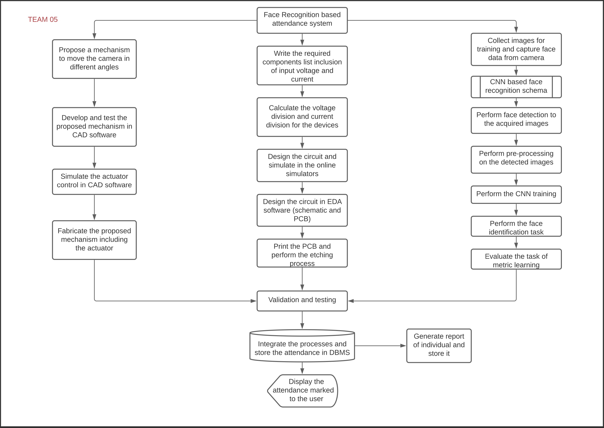

# Face Recognition-Based Attendance System

### Project Overview:
This project is a contactless attendance system using facial recognition, developed as part of my undergraduate project. The system leverages a CNN model combined with the Eigen Faces method to recognize faces with an accuracy of 95%. It was deployed on Raspberry Pi V4 and integrated with an Intel Compute Stick using OpenCV, providing a safe solution for contactless attendance during the COVID-19 pandemic.

### Features:
- Contactless attendance using face recognition.
- Developed with Convolutional Neural Networks (CNN) and Eigen Faces.
- Integration with Raspberry Pi V4 and Intel Compute Stick.
- Uses OpenCV for image processing.
- Achieves 95% accuracy in facial recognition.

### Technologies Used:
- **Python**: For developing the application.
- **TensorFlow/Keras**: For building the CNN model.
- **OpenCV**: For image capturing and processing.
- **Raspberry Pi V4**: For hardware integration.
- **Intel Compute Stick**: For accelerated AI processing.

## Project Workflow

Below is a flowchart representing the detailed process utilized for the Face Recognition-Based Attendance System project in 2020:

